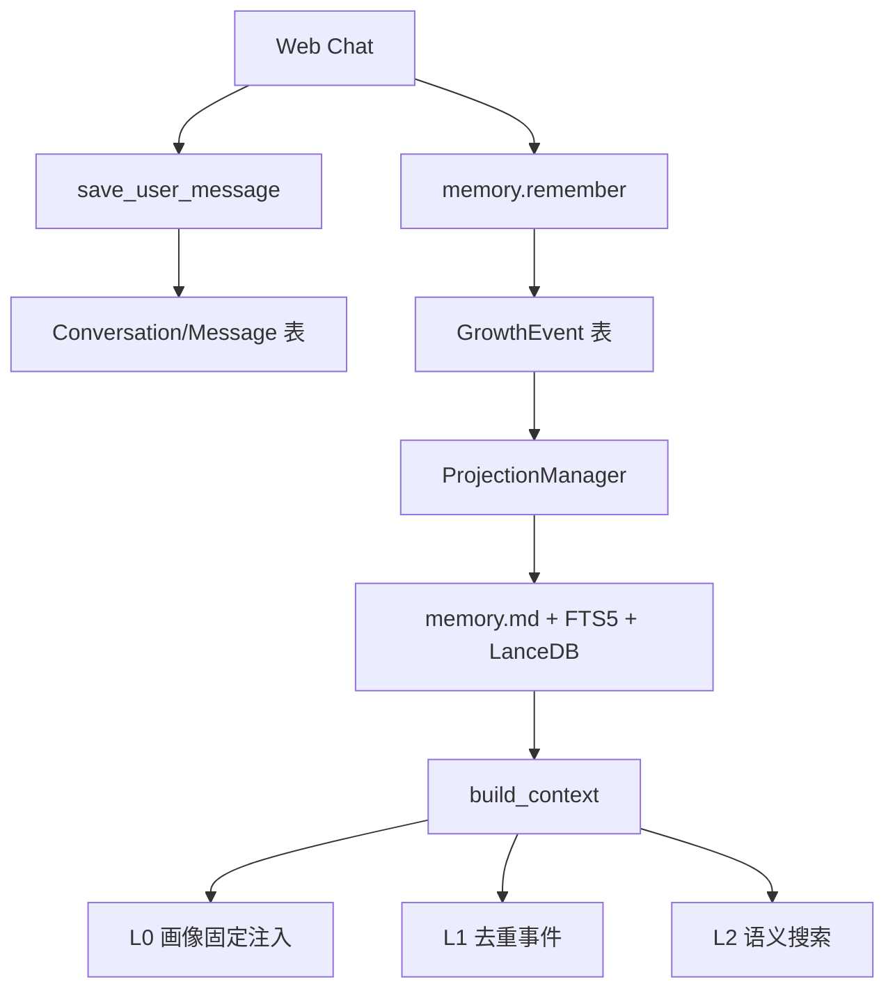
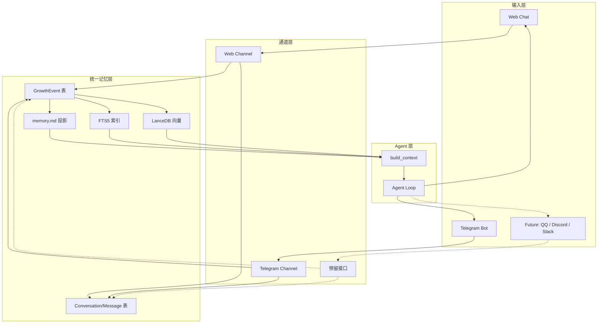
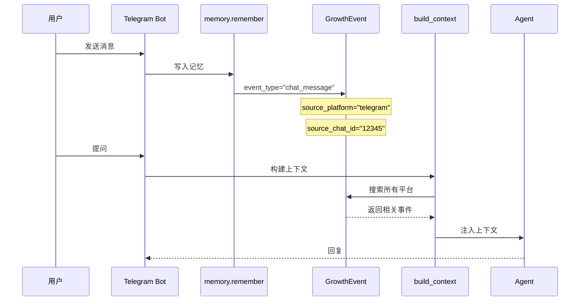
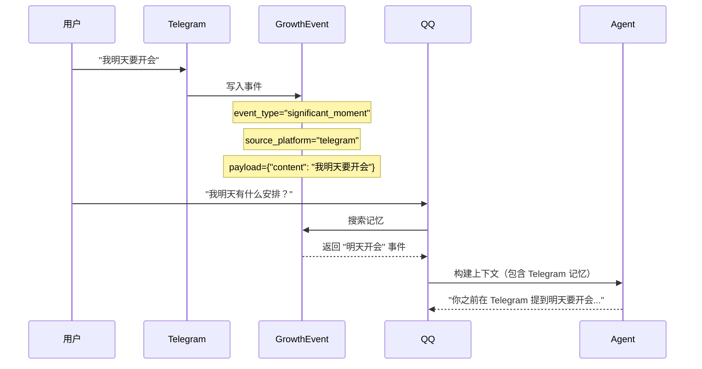
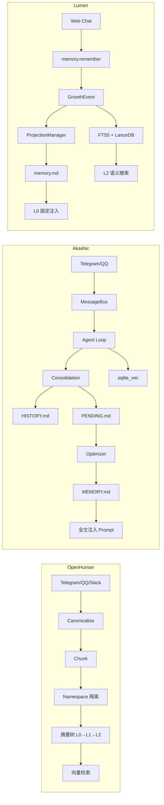

# Lumen Telegram Bot 记忆接入方案

> 基于实际代码的务实方案  
> 目标：接入 Telegram Bot，与 Web Chat 共享同一套记忆  
> 扩展性：预留 QQ Bot 接口，未来可无缝接入

---

## 当前架构（实际代码）



核心模型：
- **GrowthEvent**：语义事件（`event_type` + `payload` + `dedupe_key`）
- **Conversation/Message**：对话历史
- **双管线**：Profile（固定注入）/ Narrative（按需搜索）

---

## 问题

当前 `GrowthEvent.source` 是字符串 `"用户主动"`，没有结构化平台信息。

Bot 接入后：
- Telegram 消息 → `source="telegram"`？→ 不知道是哪个人、哪个群
- QQ 消息 → `source="qq"`？→ 同样无法追踪
- 跨平台搜索 → 无法区分"Telegram 的记忆"和"QQ 的记忆"

---

## 多平台架构图（当前：Telegram + Web）



## 数据流图



## 方案：只加 3 个字段

### GrowthEvent

```python
class GrowthEvent(Base):
    __tablename__ = "growth_events"
    
    # ── 现有字段（不变）─────────────────
    id: Mapped[str] = mapped_column(String(36), primary_key=True)
    user_id: Mapped[str] = mapped_column(String(64), nullable=False, index=True)
    event_type: Mapped[str] = mapped_column(String(32), nullable=False, index=True)
    payload_json: Mapped[str | None] = mapped_column(Text)
    source: Mapped[str] = mapped_column(String(16), nullable=False, default="用户主动")
    created_at: Mapped[datetime] = mapped_column(DateTime, nullable=False)
    dedupe_key: Mapped[str | None] = mapped_column(String(128))
    
    # ── 新增字段（3 个）─────────────────
  source_platform: Mapped[str] = mapped_column(
        String(16), 
        nullable=False, 
        default="web",
        comment="来源平台：web / telegram / qq / discord / slack"
    )
    source_chat_id: Mapped[str | None] = mapped_column(
        String(64), 
        nullable=True,
        comment="平台会话ID：Telegram chat_id"
    )
    source_message_id: Mapped[str | None] = mapped_column(
        String(64), 
        nullable=True,
        comment="平台消息ID"
    )
    source_sender_id: Mapped[str | None] = mapped_column(
        String(64), 
        nullable=True,
        comment="发送者平台ID"
    )
    
    # 2. 保存用户消息
    await save_message(
        conversation_id=conv.id,
        role="user",
        content=text,
        platform_message_id=str(update.message_id),
        platform_sender_id=str(user_id),
    )
    
    # 3. 写入记忆（和 Web Chat 同一张表）
    await memory.remember(
        user_id=user_id,
        event_type="chat_message",
        source="telegram",
        payload={"content": text},
        # 新增字段
        source_platform="telegram",
        source_chat_id=str(chat_id),
        source_sender_id=str(user_id),
    )
    
    # 4. Agent 回复（build_context 会自动搜到 Telegram 的记忆）
    context = await memory.build_context(
        user_id=user_id,
        query=text,
        source_platform="telegram",      # 优先搜 Telegram 的记忆
        source_chat_id=str(chat_id),
    )
    
    reply = await agent.run(text, context=context)
    
    # 5. 保存 Bot 回复
    await save_message(
        conversation_id=conv.id,
        role="assistant",
        content=reply,
    )
```

---

## 上下文注入改造

### build_context() 增加平台感知

```python
# lib/memory/searcher.py — MemorySearcher

async def build_context(
    self,
    user_id: str,
    query: str,
    *,
    source_platform: str | None = None,   # 新增：当前平台
    source_chat_id: str | None = None,    # 新增：当前会话
    max_tokens: int = 6000,
):
    # L0：用户画像（跨平台共享，不变）
    l0 = await self._build_l0(user_id)
    
    # L1：去重事件（新增：优先当前平台）
    l1 = await self._build_l1(
        user_id=user_id,
        source_platform=source_platform,   # 优先取该平台的事件
    )
    
    # L2：语义搜索（跨平台，不变）
    l2 = await self._build_l2(user_id, query)
    
    return f"{l0}\n\n{l1}\n\n{l2}"
```

### _build_l1() 改造

```python
async def _build_l1(self, user_id: str, source_platform: str | None = None):
    """L1：去重事件。如果指定了平台，优先取该平台的事件。"""
    
    async with get_async_session_maker()() as db:
        stmt = select(GrowthEvent).where(
            GrowthEvent.user_id == user_id,
            GrowthEvent.event_type.in_(NARRATIVE_EVENT_TYPES),
            GrowthEvent.status == "active",
        )
        
        # 新增：平台过滤
        if source_platform:
            # 优先取当前平台 + web 平台的事件
            stmt = stmt.where(
                GrowthEvent.source_platform.in_([source_platform, "web"])
            )
        
        stmt = stmt.order_by(GrowthEvent.created_at.desc()).limit(50)
        result = await db.execute(stmt)
        events = result.scalars().all()
    
    # 去重逻辑不变...
```

---

## 跨平台连续性

```
场景：
  Telegram：Alice 说"我明天要开会"
  QQ：Alice 问"我明天有什么安排？"

Telegram 流程：
  1. 消息写入 GrowthEvent(
       event_type="significant_moment",
       source_platform="telegram",
       payload={"content": "我明天要开会"}
     )
  2. ProjectionManager 更新 memory.md

QQ 流程：
  1. 消息"我明天有什么安排？"
  2. build_context(
       source_platform="qq"
     )
  3. L2 搜索搜到 "significant_moment" 事件
  4. Agent 回复："你之前在 Telegram 提到明天要开会..."
```

**关键点**：不需要 Namespace 隔离，不需要摘要树，不需要知识图谱。Lumen 的现有搜索机制（FTS5 + LanceDB）已经能处理跨平台搜索。

---

## 数据库 Migration

```sql
-- GrowthEvent：加 3 个字段
ALTER TABLE growth_events ADD COLUMN source_platform VARCHAR(16) DEFAULT 'web';
ALTER TABLE growth_events ADD COLUMN source_chat_id VARCHAR(64);
ALTER TABLE growth_events ADD COLUMN source_sender_id VARCHAR(64);

CREATE INDEX ix_growth_events_platform ON growth_events(user_id, source_platform);
CREATE INDEX ix_growth_events_chat ON growth_events(user_id, source_platform, source_chat_id);

-- Conversation：加 2 个字段
ALTER TABLE conversations ADD COLUMN platform VARCHAR(16) DEFAULT 'web';
ALTER TABLE conversations ADD COLUMN platform_chat_id VARCHAR(64);

-- Message：加 2 个字段
ALTER TABLE messages ADD COLUMN platform_message_id VARCHAR(64);
ALTER TABLE messages ADD COLUMN platform_sender_id VARCHAR(64);
```

**向后兼容**：所有新字段都有默认值，现有数据自动适配。

## 跨平台连续性示例



---

## 与同类项目的对比

### OpenHuman

| | OpenHuman | Lumen（本方案） |
|---|---|---|
| **基本单位** | Chunk（文档片段） | GrowthEvent（语义事件） |
| **来源追踪** | `namespace` + `source_kind` | `source_platform` + `source_chat_id` |
| **隔离方式** | Namespace 隔离 | 同一表，按字段过滤 |
| **内容格式** | 统一 Markdown（canonicalize） | payload_json 结构化数据 |
| **去重** | 确定性 ID（内容哈希） | `dedupe_key` + 语义相似度 |
| **摘要** | 自动摘要树（L0→L1→L2） | 无（短期内不需要） |
| **图谱** | 实体关系提取 | 无（短期内不需要） |

**OpenHuman 的核心设计**：所有来源（Telegram/QQ/Slack/Email）切成 Chunk，按 Namespace 隔离，自动摘要折叠成树。

**Lumen 不需要照搬**：GrowthEvent 比 Chunk 更语义化，有 `event_type` 和 `payload`，不需要 Namespace 隔离和摘要树。

### Akashic-Agent

| | Akashic-Agent | Lumen（本方案） |
|---|---|---|
| **定位** | 主动触达的 AI 伙伴 | 长期陪伴的 AI 伙伴 |
| **多平台接入** | MessageBus + EventBus 双总线 | 直接函数调用 |
| **会话管理** | SessionManager + identity 映射 | Conversation 表 |
| **核心记忆** | Markdown 文件（MEMORY.md / SELF.md） | GrowthEvent 表 + .md 投影 |
| **归档策略** | Optimizer 18 小时定时归档 | 实时投影 |
| **Prompt Cache** | PENDING 缓冲层保护 | 无特殊保护 |
| **向量存储** | sqlite_vec（SQLite 扩展） | LanceDB |

**Akashic-Agent 的核心设计**：Markdown 文件是真相源（人类可读，LLM 直接读写），向量层只是辅助检索。

**Akashic 对 Lumen 的借鉴点**：
- ✅ **PENDING 缓冲层**：对话后先写 PENDING.md，Optimizer 定时批量归档到 MEMORY.md，保护 prompt cache
- ✅ **SessionManager**：`identity -> chat_id` 映射，管理跨平台身份
- ✅ **记忆类型分类**：procedure / preference / event / profile

**不建议借鉴**：
- ❌ Markdown 全文注入（Lumen 的 L0/L1/L2 分层注入更可控）
- ❌ HyDE 增强（增加延迟）
- ❌ 能量值系统（过于复杂）

### 三个项目架构总览



**结论**：Lumen 的 GrowthEvent 模型比 OpenHuman 的 Chunk 更语义化，不需要引入 Chunk/Namespace/摘要树等概念。可以借鉴 Akashic 的 PENDING 缓冲层来保护 prompt cache。加 3 个字段就能解决多平台问题。

---

## 实施路线图

```
Week 1（2-3 天）：
  - 数据库 migration（3 个表加字段）
  - build_context() 增加 source_platform 参数
  - 测试 Web Chat 不受影响

Week 2（3-5 天）：
  - lib/channels/telegram.py（Telegram Bot 接入）
  - Bot 消息写入 GrowthEvent（带 source_platform）
  - 测试 Telegram 对话与 Web Chat 共享记忆
```

**总工作量**：约 1-2 周。

---

## 未来扩展

### QQ Bot

接入方式与 Telegram 完全一致：
- `source_platform="qq"`
- `source_chat_id=QQ group_id`
- 复用现有 `lib/channels/` 抽象

预计工作量：2-3 天。

---

## 参考

- Lumen 记忆模型：`lib/memory/models.py`
- Lumen 搜索层：`lib/memory/searcher.py`
- Lumen 对话模型：`lib/chat/models.py`
- OpenHuman 记忆架构：`E:\OpenHub\openhuman\src\openhuman\memory\tree\README.md`
- Akashic-Agent 记忆系统：`E:\OpenHub\akashic-agent\_handbook\memory-markdown.md`
- Akashic-Agent 架构文档：`E:\OpenHub\akashic-agent\_handbook\architecture.md`
